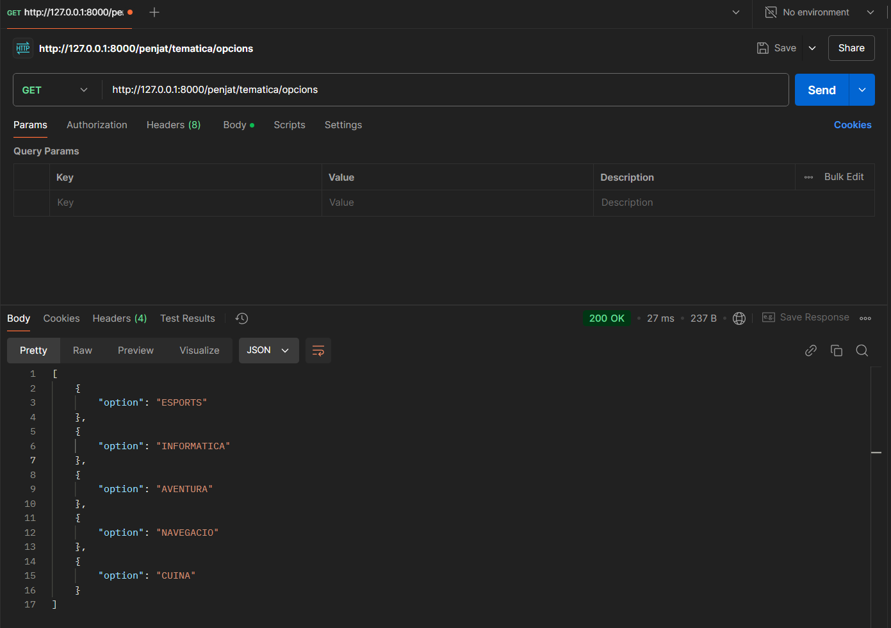
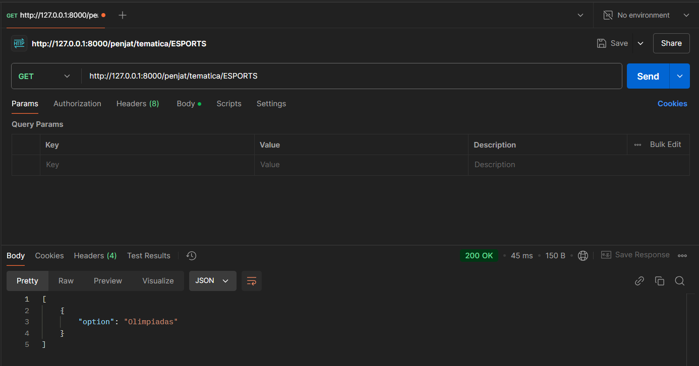
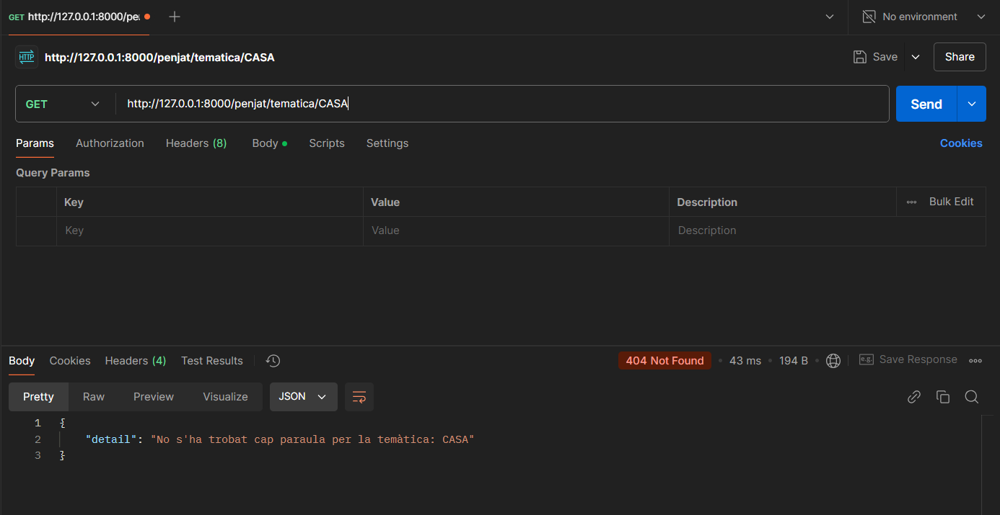

# ACTIVITAT_10

En esta actividad he hecho un endpoint que muestre las temáticas del archivo csv y otro endpoint que muestre una palabra aleatoria de la temática que le pases.

Para poder hacer esos 2 endpoints y que funcionen tenemos que tener un archivo de conexión para conectar con la base de datos, otro archivo para añadir 2 funciones que uno sirve para devolver una lista de diccionarios de las palabras, la otra función es para que devuelva una lista de diccionarios de la lista de temáticas.
El archivo principal es el main, donde ahí ponemos los 2 endpoints además de tener una función para pasar el archivo csv a json recorriendo cada linia.

### Endpoint /penjat/tematica/opcions

### Endpoint /penjat/tematica/{option}

Un ejemplo de error al pasar una tématica:
