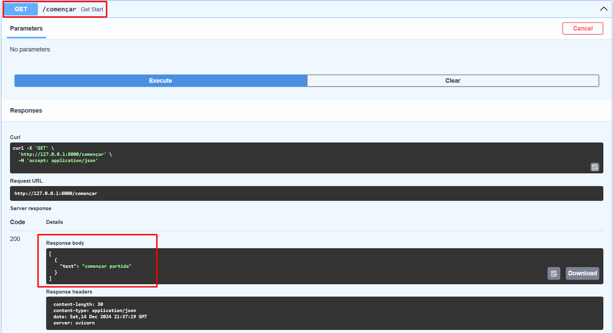
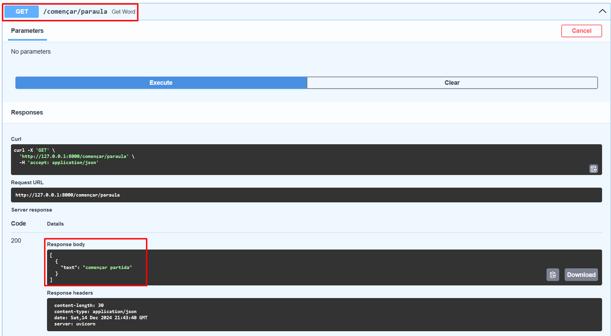
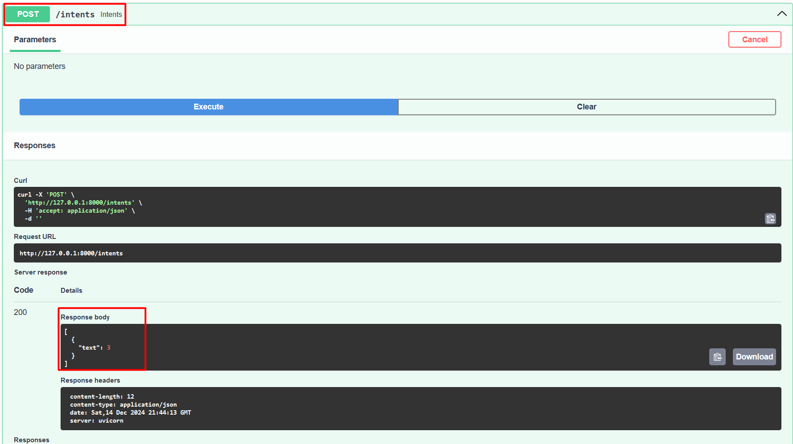
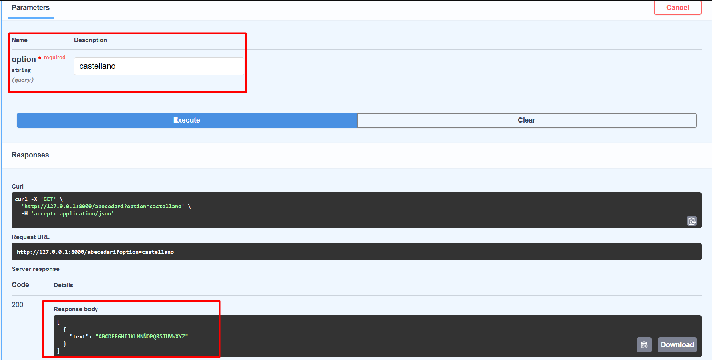
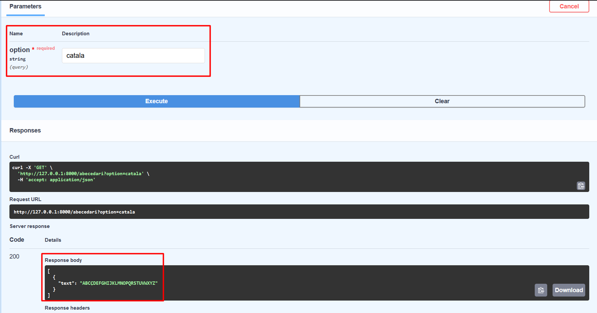
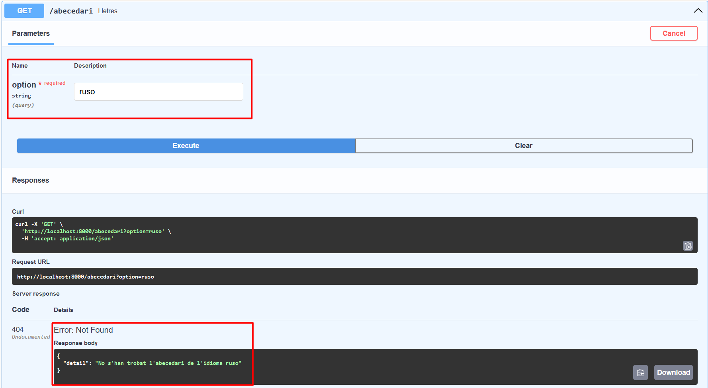

# ACTIVITAT_11

## Diseny de la base de dades

## GET de començar
El que fa aquest endpoint es retornar 'començar partida' que seria el botó que hi ha per començar a jugar. S'ha de crear una funció que reculli el valor de la bbdd.

## GET de començar para la palabra secreta
El que fa aquest endpoint es retornar 'començar partida' que seria la frase que hi ha abans de començar a jugar en el lloc de la paraula secreta. S'ha de crear una funció que reculli el valor de la bbdd.

## POST d'intents
El que fa aquest endpoint es retornar un valor incrementat al que ja tenia cada vegada que es executa en el swagger, però el que fa en el joc es que cada vegada que jugues s'incrementa el número d'intents que has fet.

## GET d'abecedari en català i castellà
El que fa aquest endpoint es retornar l'abecedari depenent que idioma li has posat. Si no reconeix l'idioma que li has posat et retorna una resposta de no trobada.
### Abecedari castellà:

### Abecedari català:

### Abecedari erroni:
