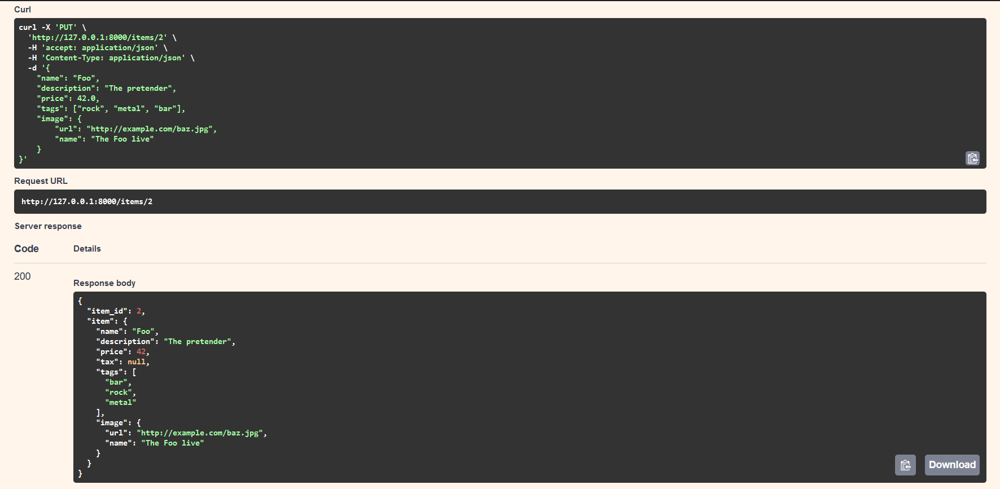
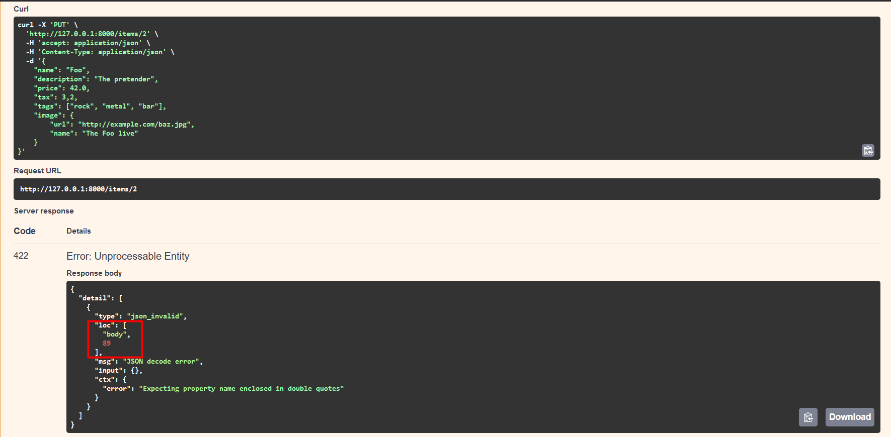

### body-fields en postman
El query y path crean objetos de subclases de una clase Param, además de que es una subclase de la clase de FieldInfo de Pydantic. Y Field de Pydantic también devuelve una instancia de FieldInfo. Body también devuelve objetos de una subclase de FieldInfo directamente.
(explicar que hace el codigo)

### Ejemplos de body-fields:
Al minimizar la longitud de la descripción del item y no cumplir con las medidas sale el siguiente error:

### body-nested en swagger
Cada atributo de un modelo de Pydantic tiene un tipo. Pero ese tipo puede ser otro modelo de Pydantic. Por lo tanto, puedes declarar "objetos" nested JSON con nombres de atributos, tipos y validaciones específicos.
(explicar que hace el codigo)

### Ejemplos de body-nested:
Si no ponemos uno de los parámetros opcionales que hay debe de salir como null:

Pero en cambio si se pone algún parámetro mal, en mi caso, el formato de poner las tasas se tiene que poner con . decimal, pero he puesto , decimal, entonces salta el error en el body:
