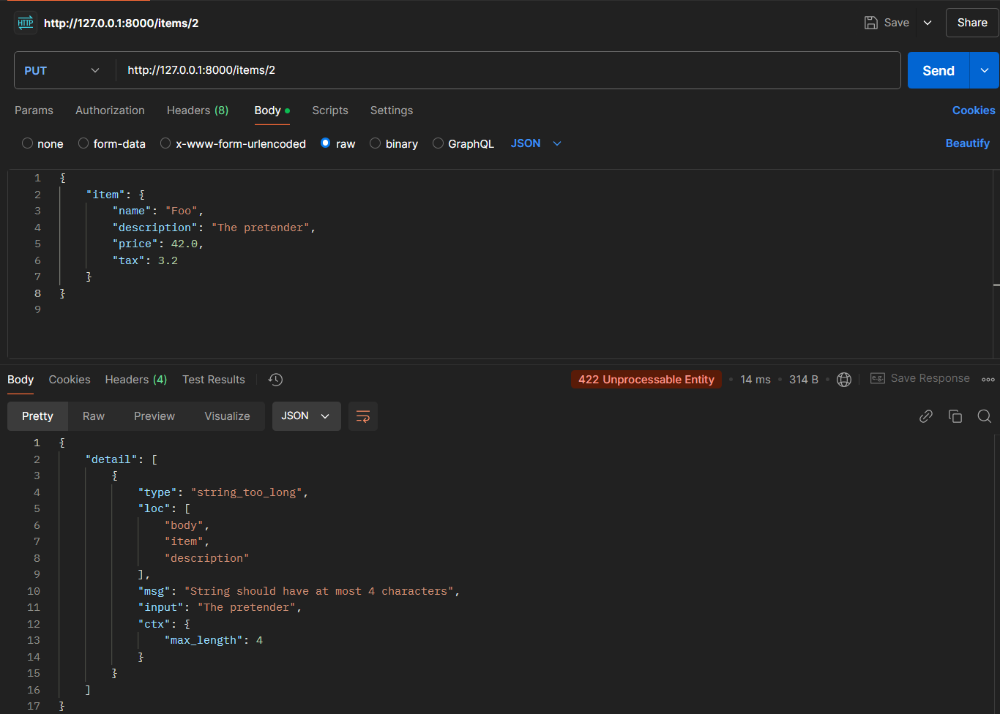
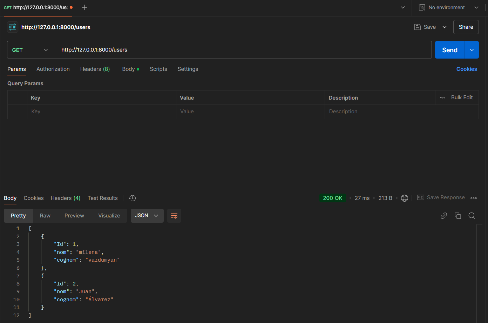

### Body-Fields en Postman
El código tiene un modelo de datos Item usando Pydantic para validar los datos de un ítem. El modelo tiene campos como name, description, price y tax, con algunas validaciones adicionales.

Luego, se crea un endpoint PUT en FastAPI (/items/{item_id}) para actualizar un ítem. Este endpoint recibe el ID del ítem en la URL y los datos del ítem en el cuerpo de la solicitud. Los datos del ítem son validados mediante el modelo Item. Finalmente, el servidor devuelve un diccionario con el ID y los datos del ítem recibidos.

### Error en Body-Fields:
Si se minimiza la longitud de la descripción de un ítem y no se cumple con las medidas mínimas requeridas, se obtiene el siguiente error:

### Body-Nested en Swagger
El códgio tiene una API en FastAPI con dos modelos: Image para representar imágenes y Item para representar ítems. El endpoint PUT /items/{item_id} permite actualizar un ítem, recibiendo los datos del ítem en el cuerpo de la solicitud y devolviendo el item_id junto con los datos recibidos.

### Ejemplos de Body-Nested:
- Si no proporcionamos uno de los parámetros opcionales, el valor correspondiente debe aparecer como null en el JSON de la respuesta:

- Sin embargo, si se proporciona un parámetro en un formato incorrecto, por ejemplo, si se espera un valor numérico con un punto decimal (.) y se utiliza una coma (,), se producirá un error en el cuerpo de la solicitud:

## PostgreSQL - FastAPI

Este proyecto está organizado en tres carpetas principales, cada una con una función específica: **conexión a la base de datos**, **schemas** y **CRUD**. Por el momento, solo se ha implementado la funcionalidad de lectura (*read*).

### main.py
Este archivo tiene un endpoint que ejecuta una consulta para leer los usuarios desde la base de datos y luego devuelve esos usuarios como una respuesta estructurada en formato JSON.

### Carpeta db_connect
Esta carpeta contiene el archivo encargado de la conexión con PostgreSQL.  
En dicho archivo se define una función que establece la conexión a la base de datos y crea un cursor para ejecutar consultas SQL.

### Carpeta schemas
En esta carpeta se encuentra el archivo donde se definen los esquemas de datos del usuario.  
Incluye dos funciones principales:
- Una función que transforma un único usuario en un diccionario con un formato específico.
- Otra función que convierte una lista de usuarios en una lista de diccionarios.

### Carpeta crud
Aquí se encuentra el archivo dedicado a la operación de lectura (*read*) de usuarios.  
Este archivo contiene la consulta necesaria para obtener todos los usuarios de la base de datos.

