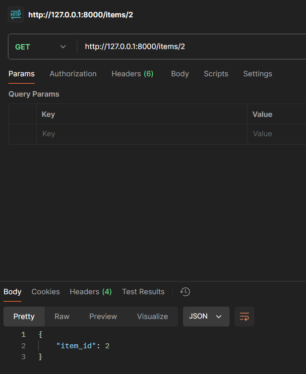
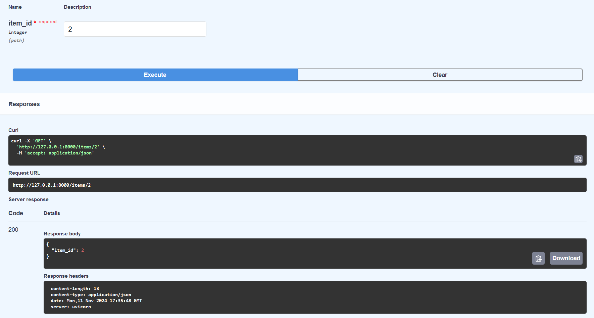
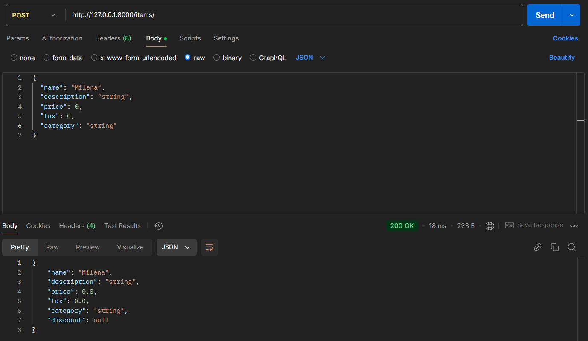
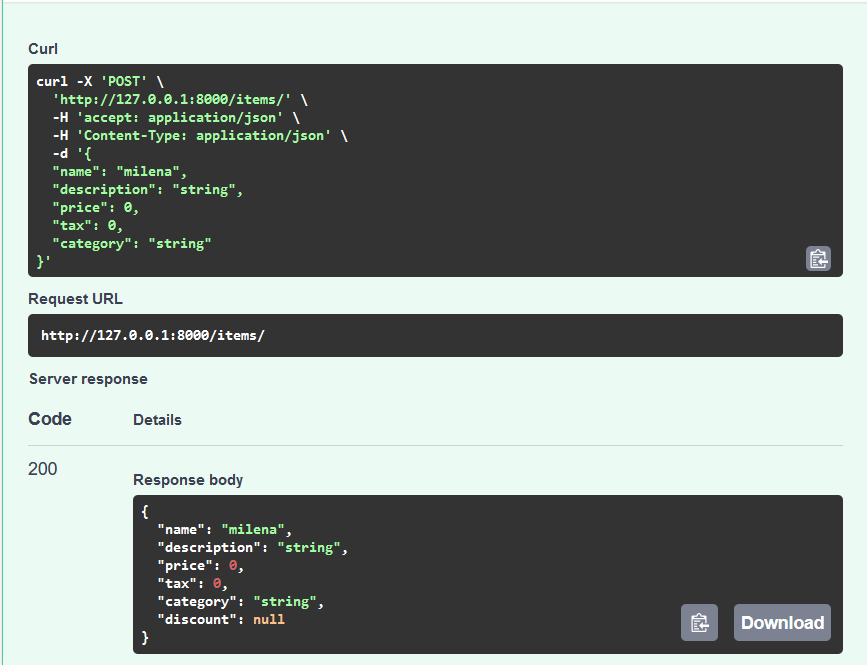
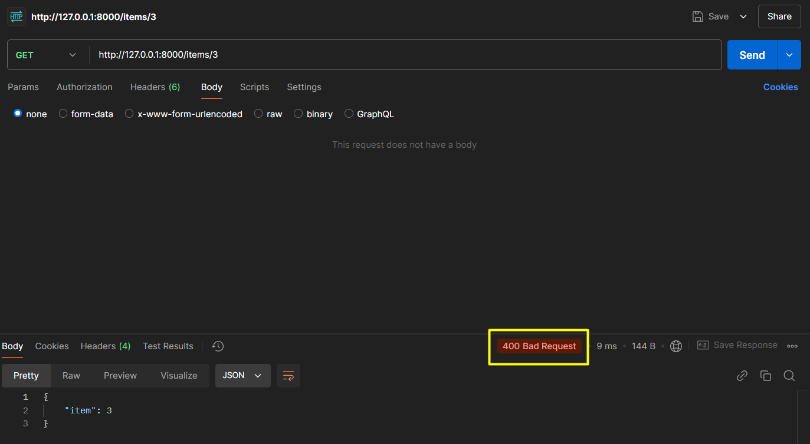
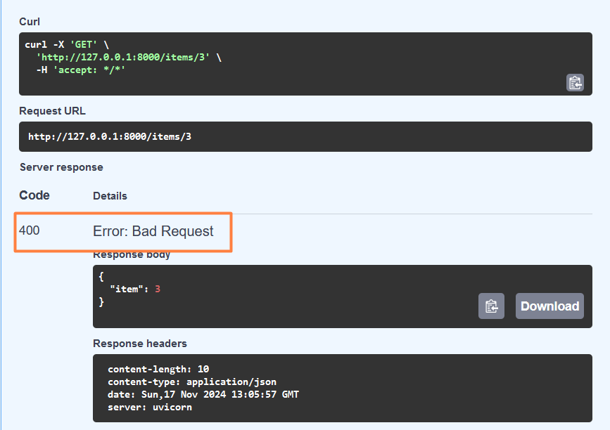
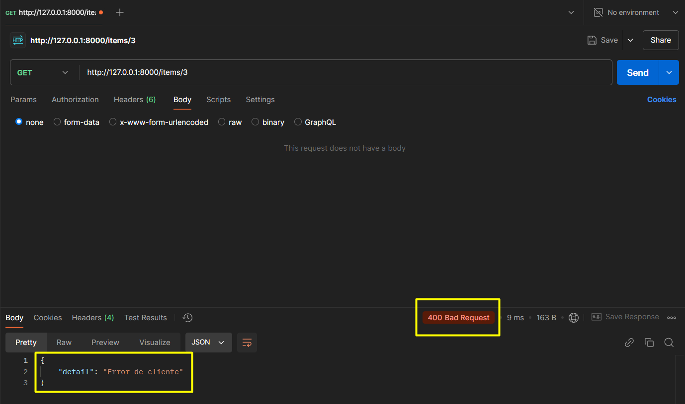
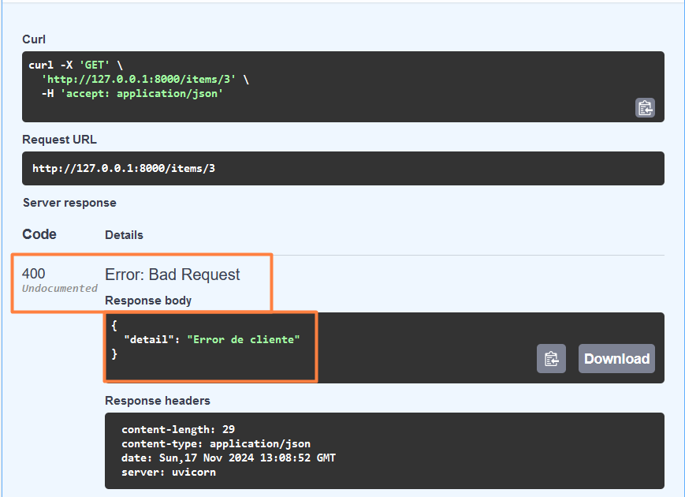

# UF2_FASTAPI

## GET
Crear al main.py una funció per a cada mètode (GET) HTTP retornant un diccionari des del return.
### Postman

### Swagger

## POST
Fer les modificacions necessàries per treballar amb BaseModel en un mètode POST.
### Postman

### Swagger

## RESPONSE
Si el mètode get no detecta un registre caldrà mostrar un error 404 amb response. (S'ha comentat de fer un altre error)
### Postman

### Swagger

## HTTPEXCEPTION
Modificar la mostra de l’error canviant la utilització de response per HTTPException.
### Postman

### Swagger
